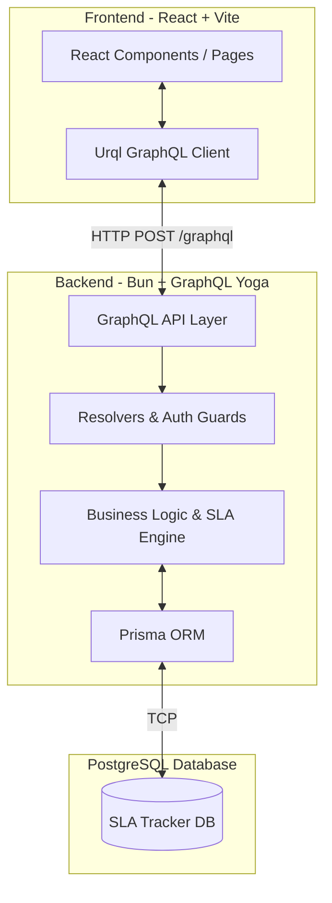
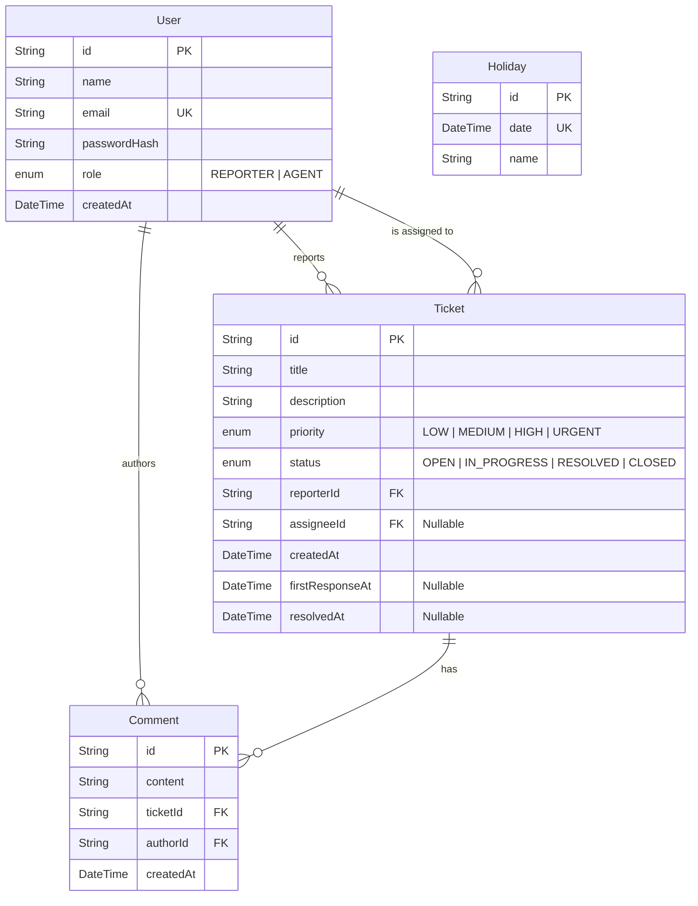

# Support Ticket & SLA Tracker

A modern, highly polished full-stack application for managing support tickets and enforcing strict SLA (Service Level Agreement) compliance. Built as part of a technical assignment to demonstrate advanced backend logic, schema-first GraphQL, and a premium SaaS frontend.

## 🚀 Tech Stack

- **Backend**: Bun, GraphQL Yoga, Prisma, PostgreSQL 15+, TypeScript.
- **Frontend**: Vite, React 19, Tailwind CSS v4, Urql, Lucide React.
- **Testing**: Vitest (Unit & Database Integration).

---

## 🏗 Architecture Overview

The backend is built around a **Schema-First GraphQL** architecture, carefully separating concerns to ensure the codebase remains maintainable, secure, and easily testable:

1. **GraphQL Schema (`schema.graphql`)**: The single source of truth for the API. We do not generate the schema from code; instead, the code conforms to the schema.
2. **GraphQL Resolvers**: Responsible *only* for GraphQL-specific concerns: parsing arguments, enforcing authorization (`requireAuth`, `requireAgent`), and throwing standard GraphQL errors (like `UNAUTHORIZED` and `FORBIDDEN`).
3. **Core Services (`src/services/`)**: Pure business logic modules (`ticket.service.ts`, `sla.service.ts`). These modules know nothing about GraphQL and can be tested completely in isolation or reused in REST controllers/CLI scripts. 
4. **Prisma Client**: Uses the `@prisma/adapter-pg` driver to connect securely to the database. Injected into resolvers via the GraphQL context for seamless mocking in tests.

### High-Level Design (HLD)



---

## 🗄 Database Schema (LLD)

The database is designed with full relational integrity and indexed for high read performance on common queries.



---

## ⏱ SLA Calculation Approach

SLA compliance is calculated dynamically taking into account business hours, weekends, and configurable holidays.

**The Rules:**
- **Business Hours**: Monday to Friday, 09:00 to 18:00 (9 AM - 6 PM).
- **Timezone**: All math is performed relative to a configured `BUSINESS_TIMEZONE` (default: `UTC`) to handle Daylight Saving Time accurately using `luxon`.
- **Off-hours & Weekends**: Time outside of business hours does not count toward the SLA budget. If a ticket is created at 20:00 or on a Saturday, the SLA clock begins precisely at 09:00 on the *next valid business day*.
- **Holidays**: Any date registered in the `Holiday` database table counts as a 0-hour day, just like a weekend.
- **SLA Freezing**: SLAs are computed dynamically against `Date.now()`, *until* the agent takes action.
  - When an Agent posts their first comment, the `ticket.firstResponseAt` timestamp is locked.
  - When an Agent resolves the ticket, the `ticket.resolvedAt` timestamp is locked.
  - The GraphQL field resolvers automatically detect these frozen timestamps and compute the final historical `SLAState` (ON_TRACK, AT_RISK, BREACHED) without updating it further.

---

## 🔄 Status Transition Rules

To prevent invalid business workflows (e.g., closing a ticket without resolving it), the system strictly enforces state machine transitions:

- **`OPEN`** → Can only transition to `IN_PROGRESS` or `RESOLVED`.
- **`IN_PROGRESS`** → Can only transition to `OPEN` or `RESOLVED`.
- **`RESOLVED`** → Can transition to `CLOSED` (accepted by reporter) or `OPEN` (reopened).
- **`CLOSED`** → Can be reopened to `OPEN`.

*Attempting to jump from `OPEN` directly to `CLOSED` will throw an `INVALID_STATUS_TRANSITION` error.*

---

## 🔐 Authentication Approach

Authentication is implemented using a stateless JWT (JSON Web Token) architecture:
- Passwords are never stored in plaintext. They are hashed using **`@node-rs/argon2`** (argon2id), which is highly resistant to both GPU cracking and side-channel attacks.
- On successful login/registration, a JWT is signed with a `JWT_SECRET`.
- The GraphQL server (`server.ts`) includes a **Context Factory** that runs on every request. It intercepts the `Authorization: Bearer <token>` header, verifies the JWT, fetches the `currentUser` from Prisma, and attaches it to the `GraphQLContext`.
- Resolvers simply check `ctx.currentUser` and `ctx.currentUser.role` to authorize actions.

---

## 🛠 Setup Instructions

### 1. Start the Database
Ensure Docker is installed, then spin up the PostgreSQL container:
```bash
docker-compose up -d
```

### 2. Setup the Backend
Open a terminal in the `backend/` directory:
```bash
cd backend
bun install

# Run migrations to create all tables with proper indexes
bunx prisma migrate dev

# Run the seeder to populate dummy data
bun run prisma/seed.ts

# Start the GraphQL API Server
bun run dev
```

### 3. Setup the Frontend
Open a new terminal in the `frontend/` directory:
```bash
cd frontend
bun install

# Start the Vite development server
bun run dev
```
Navigate to **http://localhost:5173**.

### 4. Test Credentials
The database seeder provisions two users you can use to test role-based access:
- **Agent**: `agent@example.com` / `password123`
- **Reporter**: `reporter@example.com` / `password123`

### 5. Running Tests
```bash
cd backend

# Run all tests (unit + integration)
bun run test

# Watch mode for development
bun run test:watch
```
The integration test requires the Docker PostgreSQL container to be running and `DATABASE_URL` to be set in `.env`.

---

## 📡 Example GraphQL Queries & Mutations

All requests go to `http://localhost:4000/graphql`. Authenticated requests require the header:
```
Authorization: Bearer <token>
```

### Auth
```graphql
# Register a new user
mutation {
  register(name: "Alice", email: "alice@example.com", password: "secret", role: REPORTER) {
    token
    user { id name role }
  }
}

# Login
mutation {
  login(email: "agent@example.com", password: "password123") {
    token
    user { id name role }
  }
}
```

### Tickets
```graphql
# Create a ticket (requires auth)
mutation {
  createTicket(title: "Login broken", description: "Users cannot log in.", priority: HIGH) {
    id title status priority
    firstResponseSLA { state targetDate remainingBusinessMinutes }
    resolutionSLA { state targetDate remainingBusinessMinutes }
  }
}

# List tickets with filters and pagination
query {
  tickets(status: OPEN, priority: HIGH, take: 10) {
    nodes {
      id title status priority
      assignee { name }
      resolutionSLA { state remainingBusinessMinutes }
    }
    pageInfo { hasNextPage endCursor }
  }
}

# Fetch a single ticket
query {
  ticket(id: "<ticket-id>") {
    id title description status priority
    reporter { name }
    assignee { name }
    firstResponseSLA { state targetDate remainingBusinessMinutes }
    resolutionSLA { state targetDate remainingBusinessMinutes }
    comments { id content createdAt author { name role } }
  }
}

# Dashboard summary
query {
  dashboard {
    openTickets inProgressTickets atRiskTickets breachedTickets
  }
}
```

### Agent Actions (requires AGENT role)
```graphql
# Assign ticket
mutation {
  assignTicket(ticketId: "<id>", assigneeId: "<agent-id>") {
    id assignee { name }
  }
}

# Change status
mutation {
  changeTicketStatus(ticketId: "<id>", status: IN_PROGRESS) {
    id status
  }
}

# Resolve ticket
mutation {
  resolveTicket(ticketId: "<id>") {
    id status resolvedAt
    resolutionSLA { state }
  }
}

# Add comment
mutation {
  addComment(ticketId: "<id>", content: "Investigating now.") {
    id content createdAt author { name role }
  }
}

# Add holiday
mutation {
  addHoliday(date: "2026-01-26", name: "Republic Day") {
    id date name
  }
}
```

---

## 🔮 How I'd Extend This (Future Work)

If this were a production system, I would implement the following expansions:
1. **SLA Pauses (Pending Customer)**: Introduce a `PENDING_CUSTOMER` status. When active, the SLA clock pauses. This requires storing a log of status transitions and time spent in each state to deduct from the elapsed SLA time.
2. **Recurring Holidays**: Update the `Holiday` schema to distinguish between one-off dates (e.g., Nov 24, 2024) and recurring dates (e.g., Dec 25 every year) so admins don't have to manually input Christmas every year.
3. **Email/Slack Notifications**: Hook into the `ticket.service.ts` to trigger asynchronous background jobs (using BullMQ or similar) to send emails when tickets are created, assigned, or at risk of breaching SLAs.
4. **Audit Logs**: Create a `TicketEvent` table to track every status change, assignment, and priority update for compliance reporting.
